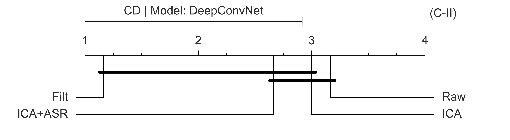

# How important is EEG preprocessing in deep learning applications?

This is the official repository for the research paper 

    The more, the better? Evaluating the role of
    EEG preprocessing for deep learning applications.

Published in IEEE Transactions on Neural Systems and Rehabilitation Engineering.

[](https://doi.org/10.1109/TNSRE.2025.3547616)

In this work, we have investigated the effect of EEG
data preprocessing on the performance of deep learning models.
In particular, we have evaluated whether or not raw data can be
effectively fed to DL models without losing predictive power.
Furthermore, we have compared pipelines with different
levels of complexity, from a minimal filtering to a richer
one with established automated artifact handling algorithms.

## How was the comparison designed

The paper describes in the detail the experimental methodology. 
Markdown files in the docs folder provide additional information
on the provided code.
Here, we report a brief description of the key points.

### Models and Tasks

We used six different tasks, covering a wide range of possible
clinical and non-clinical use cases,
and four different deep learning architectures.

Tasks:
* **Eye**: physiological classification of eyes open and eyes
  closed recordings.
* **MMI**: motor movement imagery, famous BCI application
  largely studied in the domain.
* **Parkinson**, **FEP**, **Alzheimer**: two and three classes
  pathology classification focused on relevant medical
  use-cases, such as Parkinson’s, Psychosis and Alzheimer’s
  diseases.
* **Sleep**: normal sleep vs sleep deprivation recognition.

Models:
* **EEGNet**
* **DeepConvNet**
* **ShallowNet**
* **FBCNet**

### Model Evaluation

Data were partitioned using a proposed variant of the
Leave-N-Subjects-Out Cross Validation, called 
Nested Leave-N-Subjects-Out Cross Validation, schematized in
the figure below.
Each model was evaluated using different metrics, and the results
were used to perform statistical analysis to assess differences
between the investigated pipelines.

<div align="center">
  
</div>

### Statistical Analysis

We looked for differences in the pipelines at both the local level
(single model single task) and the model level (single model
all tasks).
Specific statistical tests were used for each level, 
using the balanced accuracy as the evaluation metric and the
median value as the centrality measure.
Results were presented with dedicated figures. 
An example is shown below

<div align="center">
  
</div>

<div align="center">
  
</div>


## Provided code

Scripts used to generate the results presented in the paper
are available in this repository.
Additional instructions on how to replicate
our experimental pipeline are provided in the
[docs](https://github.com/MedMaxLab/eegprepro/tree/main/docs) folder.

## Results

Performance metrics of each trained model are collected and organized in
the **ResultsTable.csv** file. In addition, each **TaskClassification** folder
(e.g., AlzClassification, EoecClassification) has a zpack mode 5 file that
compresses a set of pickle files containing model predictions, ground truths,
and performance metrics. 

## Authors and Citation

If you find this repository useful for your research,
please concider citing our work. It would help us to continue our research.

```bibtex
@article{eegprepro,
  author = {Del Pup, Federico and
            Zanola, Andrea and
            Fabrice Tshimanga, Louis and
            Bertoldo, Alessandra and
            Atzori, Manfredo},
  journal = {IEEE Transactions on Neural Systems and Rehabilitation Engineering}, 
  title = {The More, the Better? Evaluating the Role of EEG Preprocessing for Deep Learning Applications}, 
  year = {2025},
  volume = {33},
  number = {},
  pages = {1061-1070},
  doi = {10.1109/TNSRE.2025.3547616}
}
```

Contributors:

- Eng. Federico Del Pup
- M.Sc. Andrea Zanola
- M.Sc. Louis Fabrice Tshimanga
- Prof. Alessandra Bertoldo
- Prof. Manfredo Atzori

## License

The code is released under the MIT License
