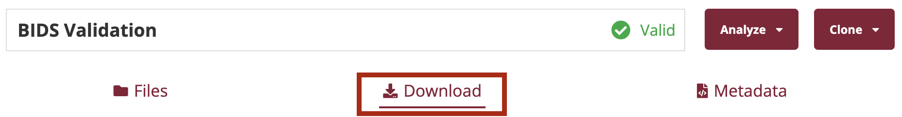

# Dataset download

All dataset can be freely downloaded from [OpenNeuro](https://openneuro.org/).
To download them, please take a look at the download section of each specific dataset (see the following screenshot).



Here we include a list of all the dataset you need to download.

* [ds004148](https://openneuro.org/datasets/ds004148/)
* [ds004362](https://openneuro.org/datasets/ds004363/)
* [ds002778](https://openneuro.org/datasets/ds002778/)
* [ds003490](https://openneuro.org/datasets/ds003490/)
* [ds004504](https://openneuro.org/datasets/ds004504/)
* [ds004902](https://openneuro.org/datasets/ds004902/)
* [ds003947](https://openneuro.org/datasets/ds003947/)

Some datasets may require to change their folder structure.
To do that, just call the ``create_dataset_architecture``
function, which changes in place the dataset structure.

# Dataset preprocessing

Datasets should be preprocessed 4 times with the investigated pipelines.
A full description of the steps and parameters of each
pipelines can be found in the relative paper.
Here, it is sufficient to say that each pipeline adds new steps to the previous one.

The simplest way to preprocess EEG data with BIDSAlign,
especially if you are a novice, is by using the
``preprocess_all_script.m`` provided in the main repo.

Please, refer to the [step-by-step guide](https://github.com/MedMaxLab/BIDSAlign/tree/main/docs),
for more detailed information on how to use BIDSAlign.

In short, you just need to modify the parameters
of the four different struct variables (lines 39, 58, 70, 140) 
according to the specific pipeline setting.


In particular:

* **Paths (line 140)**: write the paths needed to locate
  source files and store preprocessed ones.
  Remember also to change the modality (line 21) to "local".
* **Output (line 58)**: at least need the .mat files stored
  as a matrix (2D array) should be stored.
  Here the minimal configuration:
  ```
  save_info = struct('save_data',    true, ...
                     'save_data_as', 'matrix', ...
                     'save_set',     false , ...
                     'save_struct',  true, ...
                     'save_marker',  false , ...
                     'set_label',    ' ');
  ```
  We also suggest to preprocess each group separately and give a
  custom label with the set_label field. For example, if you have
  preprocessed all the Alzheimer's subjects with the
  FILT pipeline described in the paper, you can use the label,
  "FILT_A". In this way, you can better organize this phase
  and be sure to not have missed something.
* **Selection (line 39)**: put ``select_subject`` to true and
  change the ``label_name``, ``label_value``,
  ``subjects_totake``, ``session_totake``, ``task_totake``
  according to the specific group to select. Read the
  dataset selection section of the paper to see which subset
  of subject we have preprocessed. Again, we suggest to give a
  custom label with the set_label field of the save_info struct
  to be sure to not miss any group
* **Selection (line 39)**: use the following parameters.
  You can also use the **preprocessing_info.mat** file
  provided in the Preprocessing folder
  ```
  params_info = struct('low_freq', 1 , ...
                     'high_freq', 45, ...
                     'sampling_rate',      250, ...
                     'standard_ref',       'COMMON', ...
                     'interpol_method',    'spherical' , ...
                     'flatlineC',          5 , ...
                     'channelC',           0.8 , ...
                     'lineC',              4, ...
                     'burstC',             20 , ...
                     'windowC',            0.25 , ...
                     'burstR',             'off' , ...
                     'th_reject',          0 , ...
                     'ica_type',           'runica' , ...
                     'non_linearity',      'tanh' , ...
                     'n_ica',              0 , ...
                     'ic_rej_type',        'iclabel' , ...
                     'iclabel_thresholds', [0 0.1; ...
                                            0.9 1; ...
                                            0.9 1; ...
                                            0.9 1; ...
                                            0.9 1; ...
                                            0.9 1; ...
                                            0.9 1] , ...
                     'mara_threshold',     0.9 , ...
                     'dt_i',               8 , ...
                     'dt_f',               8 , ...
                     'prep_steps', ...
                          struct('rmchannels' , true , ...
                                 'rmsegments' , true , ...
                                 'rmbaseline' , true , ...
                                 'resampling' , true , ...
                                 'filtering'  , true , ...
                                 'ICA'        , false , ...
                                 'ICrejection', true, ...
                                 'ASR'        , true, ...
                                 'rereference', true) ...
                                 );
  ```
  ``prep_steps`` should be changed according to the specific
  pipeline.

  Additionally, the EEGMMI dataset for motorimagery was
  preprocessed with a slightly modified version of the library.
  To preprocess this dataset, you just need to copy all the
  matlab script of the Preprocessed folder inside the
  ``__lib`` folder of the BIDSAlign package.
  Then, change ``dt_i`` and ``dt_f`` to ``0``,
  ``save_set`` to ``true``, and
  ``task_totake`` to ``{{ 'run-4' 'run-8' 'run-12'}}``.
  After that, you finally need to run the
  ``EEGMMI_splitter_LeftRight.m`` script to extract the
  trials from the preprocessed .set files.

  As you can see, there's lot of work to do and, unfortunately,
  we cannot upload the preprocessed files here on github.


## Conversion to pickle

We have also converted all the mat files in pickle format to
speed up file loading operations. 
(See the supplementary materials of the paper for additional information.)
This operation can be easily done with the
``MatlabToPickle.ipynb`` Notebook.
The only thing worth mentioning is that you need to change
the ``save_path`` (now it is '/data/delpup/eegpickle/') to
your desired path.

**IMPORTANT:** ``save_path`` should point to a folder that has
four additional subfolders with names
**raw**, **filt**, **ica**, **icasr**. These folders will
be used to store all the files preprocessed with the respective
pipeline and will be used to search the specific records to use
during model training


## Expected result

In the end, the entire data preparation step should generate a 
series of pickle files stored inside four folders with name
**raw**, **filt**, **ica**, **icasr**, all of them stored inside
a custom **save path**.
Pickle files will have a name composed of four numbers separated
by an underscore character, identifying the dataset, subject,
session, and trial IDs.